Descripción del dataset
=======================

El dataset seleccionada es el del hundimiento del titanic de Kaggle
\[<a href="https://www.kaggle.com/c/titanic/data" class="uri">https://www.kaggle.com/c/titanic/data</a>\]

El hundimiento del **RMS Titanic** es una de los hundimientos de barcos
más famosos de la historia. El incidente ocurrió entre el día 14 y 15 de
abril de 1912. Durante su viaje inaugural entre Southampton y Nueva
York, el transatlántico británico cochó contra un iceberg en el oceano
Atlántico frente a las costas de Terranova. Tras el choque el
translatlántico se hundío y murieron 1502 personas de 2224 pasajeros y
tribulates.

Esta tragedia ha sido una de las mayores tragedias naúticas en tipo de
paz. Las causas del número de fallecidos fueron consecuencia de la falta
de botes salvavidas. Pero además, en diferentes estudios se ha visto que
la suerte de los supervivientes estaban realionadas con distintas
características de los viajes y tripulantes.

En el siguiente estudio se pretende ver que tipo de personas tuvieron la
suerte de sobrevivir. Teniendo en cuenta su género, clase social y edad.

Los datos se han dividido en dos grupos:

-   **El conjunto de entrenamiento** usado para crear el modelo de
    entrenamiento para un modelo. Para este grupo se le aporta la clase
    de salida (también conocidad como *ground truth*)
-   **El conunto de test** usado para comprobar lo bien que predice el
    modelo. En este grupo no se aporta la clase de salida. Sino que este
    grupo es utilizado para verificar los bien que modelo predice si un
    pasajero habría sobrevivido o no dependiendo de sus propiedades.

Conjunto de entrenamiento
-------------------------

El conjunto de entrenamiento es un fichero csv en código ASCII que
consta de los siguiente atributos. Este fichero incluye las cabeceras
dentro del fichero y los campos están separados por “,”.

<table>
<colgroup>
<col style="width: 28%" />
<col style="width: 35%" />
<col style="width: 35%" />
</colgroup>
<thead>
<tr class="header">
<th>Variable</th>
<th>Descripción</th>
<th>Valores</th>
</tr>
</thead>
<tbody>
<tr class="odd">
<td>PassengerId</td>
<td>Identificador de pasajero</td>
<td></td>
</tr>
<tr class="even">
<td>Survived</td>
<td>Sobrevivió</td>
<td>0 = No, 1 = Sí</td>
</tr>
<tr class="odd">
<td>pclass</td>
<td>Tipo del billete</td>
<td>1 = Primera clase, 2 = Segunda Clase, 3 = Tercera Clase</td>
</tr>
<tr class="even">
<td>Name</td>
<td>Nombre</td>
<td></td>
</tr>
<tr class="odd">
<td>Sex</td>
<td>Género</td>
<td>male = Hombre, female= Mujer</td>
</tr>
<tr class="even">
<td>Age</td>
<td>Edad en Años</td>
<td></td>
</tr>
<tr class="odd">
<td>Sibsp</td>
<td>Número de familiares a bordo (hermanos, pareja)</td>
<td></td>
</tr>
<tr class="even">
<td>Parch</td>
<td>Número de famliares a bordo (padres e hijos)</td>
<td></td>
</tr>
<tr class="odd">
<td>Ticket</td>
<td>Número del billete</td>
<td></td>
</tr>
<tr class="even">
<td>Fare</td>
<td>Precio del billete</td>
<td></td>
</tr>
<tr class="odd">
<td>Cabin</td>
<td>Número de cabina</td>
<td></td>
</tr>
<tr class="even">
<td>Embarked</td>
<td>Puerto de embarque</td>
<td>C = Cherbourg, Q = Queenstown, S = Southampton</td>
</tr>
</tbody>
</table>

Conjuto de test
---------------

El conjuto de tes también es un fichero csv en código ASCII que consta
de los siguientes atributos Este fichero incluye las cabeceras dentro
del fichero y los campos están separados por “,”.

<table>
<colgroup>
<col style="width: 11%" />
<col style="width: 38%" />
<col style="width: 50%" />
</colgroup>
<thead>
<tr class="header">
<th>Variable</th>
<th>Descripción</th>
<th>Valores</th>
</tr>
</thead>
<tbody>
<tr class="odd">
<td>PassengerId</td>
<td>Identificador del pasajero</td>
<td></td>
</tr>
<tr class="even">
<td>Pclass</td>
<td>Tipo del billete</td>
<td>1 = Primera clase, 2 = Segunda Clase, 3 = Tercera Clase</td>
</tr>
<tr class="odd">
<td>Name</td>
<td>Nombre</td>
<td></td>
</tr>
<tr class="even">
<td>Sex</td>
<td>Género</td>
<td>male = Hombre, female= Mujer</td>
</tr>
<tr class="odd">
<td>Age</td>
<td>Edad en Años</td>
<td></td>
</tr>
<tr class="even">
<td>SibSp</td>
<td>Número de familiares a bordo (hermanos, pareja)</td>
<td></td>
</tr>
<tr class="odd">
<td>Parch</td>
<td>Número de famliares a bordo (padres e hijos)</td>
<td></td>
</tr>
<tr class="even">
<td>Ticket</td>
<td>Número del billete</td>
<td></td>
</tr>
<tr class="odd">
<td>Fare</td>
<td>Precio del billete</td>
<td></td>
</tr>
<tr class="even">
<td>Cabin</td>
<td>Número de cabina</td>
<td></td>
</tr>
<tr class="odd">
<td>Embarked</td>
<td>Puerto de embarque</td>
<td>C = Cherbourg, Q = Queenstown, S = Southampton</td>
</tr>
</tbody>
</table>

Para una mejor compresión del dataset tenemos que tener encuenta las
siguientes consideraciones

**Age**: la edad en caso de viajeros que no superen más de un año es
fraccional.

**SibsP**: Determina el númeor de familiares del tipo hermanos y pareja
- Hermanos: incluye hermanos, hermanas, hermanástros y hermanástras -
Pareja: esposos y esposas. Los novios y amantes fueron descartados
**Parch**: - Padre: madre y padre - Hijo: hijos, hijas, hijastros e
hijastras.

Integración y selección de los datos de interés a analizar
==========================================================

El primer paso que vamos a realizar es la carga de ambos ficheros en un
mismo dataframe. Como podemos comprobar los dos ficheros, tienen los
mismos campos exceptuando la clase de salida, que en el caso de conjunto
test no existe. Ya que es el objeto de la competición de Kaggle. Pero
uniendo los dos ficheros en un dataframe único, podemos realizar un
análisis y limpieza única con toda la población, observando datos
perdidos, valores extremos y otros posibles errores. Una vez realizado
el trabajo de limpieza, podeos volver a separar para aplicar los
modelos.

Hay que tener en cuenta que el archivo csv debe estar en el directorio
“kaggle” dentro de nuestro directorio de trabajo. En caso contrario hay
que especificar la ruta absoluta al archivo.

``` r
# Leemos los datos de entrenamiento
train <- read.csv("./kaggle/train.csv")
# Leemos los datos de test
test <- read.csv("./kaggle/test.csv")

# Variable con las propiedades no incluyendo la clase salida
properties = colnames(test)
# Variable con la clase salida
class = c("Survived")
# Creamos un dataframe unico con todos los datos
titanic_raw <- bind_rows(train, test) 

# Creamos un dataframe donde realizamos las operaciones
titanic <- titanic_raw
```

Realizamos una comprobación visual, para ver si se han cargado los datos
con las propiedades que hemos determinado en el apartado anterior.

``` r
# Echamos un vistazo a los datos
str(titanic)
```

    ## 'data.frame':    1309 obs. of  12 variables:
    ##  $ PassengerId: int  1 2 3 4 5 6 7 8 9 10 ...
    ##  $ Survived   : int  0 1 1 1 0 0 0 0 1 1 ...
    ##  $ Pclass     : int  3 1 3 1 3 3 1 3 3 2 ...
    ##  $ Name       : chr  "Braund, Mr. Owen Harris" "Cumings, Mrs. John Bradley (Florence Briggs Thayer)" "Heikkinen, Miss. Laina" "Futrelle, Mrs. Jacques Heath (Lily May Peel)" ...
    ##  $ Sex        : Factor w/ 2 levels "female","male": 2 1 1 1 2 2 2 2 1 1 ...
    ##  $ Age        : num  22 38 26 35 35 NA 54 2 27 14 ...
    ##  $ SibSp      : int  1 1 0 1 0 0 0 3 0 1 ...
    ##  $ Parch      : int  0 0 0 0 0 0 0 1 2 0 ...
    ##  $ Ticket     : chr  "A/5 21171" "PC 17599" "STON/O2. 3101282" "113803" ...
    ##  $ Fare       : num  7.25 71.28 7.92 53.1 8.05 ...
    ##  $ Cabin      : chr  "" "C85" "" "C123" ...
    ##  $ Embarked   : chr  "S" "C" "S" "S" ...

Observamos que hay 1309 que son la suma de los 418 elementos de test más
los 891 elementos de entrenamiento que corresponde con la información
que nos aporta kaggle.

Clase de salida Survived
------------------------

Todas estas observaciones tiene 12 propiedades, que corresponde a 11
atributos más la clase de salidad *Survived* donde los datos de test
tendrían que tener el valor de NA.

Pero pasamos a comprobarlo.

``` r
# Número de instancias con el valor Survived Nulo
str(titanic %>% filter(is.na(Survived)))
```

    ## 'data.frame':    418 obs. of  12 variables:
    ##  $ PassengerId: int  892 893 894 895 896 897 898 899 900 901 ...
    ##  $ Survived   : int  NA NA NA NA NA NA NA NA NA NA ...
    ##  $ Pclass     : int  3 3 2 3 3 3 3 2 3 3 ...
    ##  $ Name       : chr  "Kelly, Mr. James" "Wilkes, Mrs. James (Ellen Needs)" "Myles, Mr. Thomas Francis" "Wirz, Mr. Albert" ...
    ##  $ Sex        : Factor w/ 2 levels "female","male": 2 1 2 2 1 2 1 2 1 2 ...
    ##  $ Age        : num  34.5 47 62 27 22 14 30 26 18 21 ...
    ##  $ SibSp      : int  0 1 0 0 1 0 0 1 0 2 ...
    ##  $ Parch      : int  0 0 0 0 1 0 0 1 0 0 ...
    ##  $ Ticket     : chr  "330911" "363272" "240276" "315154" ...
    ##  $ Fare       : num  7.83 7 9.69 8.66 12.29 ...
    ##  $ Cabin      : chr  "" "" "" "" ...
    ##  $ Embarked   : chr  "Q" "S" "Q" "S" ...

``` r
#Comprobamos  que los PassengerID son los mismos en el dataframe titanic con Survived a NA y los de test
str(setdiff(test %>% select("PassengerId"), titanic %>% filter(is.na(Survived)) %>% select("PassengerId") ))
```

    ## 'data.frame':    0 obs. of  1 variable:
    ##  $ PassengerId: int

Como vemos el número de observaciones con Survived igual a NA
corresponde al número de test y además no hay diferencias de los códigos
de los pasajeros (PassengerId). Por lo que los NA corresponde a los
datos del conjunto de test.

Así que hemos realizado correctamente la integración de los dos ficheros
csv.

``` r
titanic$Survived <- as.factor(titanic$Survived)
levels(titanic$Survived)
```

    ## [1] "0" "1"

PassengerId
-----------

Ahora procedemos ha imprimir un resumen del dataframe para estudiar
nuestra propiedades

``` r
# Resumen de las propiedades sin contar la clase de salida
summary(titanic[properties])
```

    ##   PassengerId       Pclass          Name               Sex     
    ##  Min.   :   1   Min.   :1.000   Length:1309        female:466  
    ##  1st Qu.: 328   1st Qu.:2.000   Class :character   male  :843  
    ##  Median : 655   Median :3.000   Mode  :character               
    ##  Mean   : 655   Mean   :2.295                                  
    ##  3rd Qu.: 982   3rd Qu.:3.000                                  
    ##  Max.   :1309   Max.   :3.000                                  
    ##                                                                
    ##       Age            SibSp            Parch          Ticket         
    ##  Min.   : 0.17   Min.   :0.0000   Min.   :0.000   Length:1309       
    ##  1st Qu.:21.00   1st Qu.:0.0000   1st Qu.:0.000   Class :character  
    ##  Median :28.00   Median :0.0000   Median :0.000   Mode  :character  
    ##  Mean   :29.88   Mean   :0.4989   Mean   :0.385                     
    ##  3rd Qu.:39.00   3rd Qu.:1.0000   3rd Qu.:0.000                     
    ##  Max.   :80.00   Max.   :8.0000   Max.   :9.000                     
    ##  NA's   :263                                                        
    ##       Fare            Cabin             Embarked        
    ##  Min.   :  0.000   Length:1309        Length:1309       
    ##  1st Qu.:  7.896   Class :character   Class :character  
    ##  Median : 14.454   Mode  :character   Mode  :character  
    ##  Mean   : 33.295                                        
    ##  3rd Qu.: 31.275                                        
    ##  Max.   :512.329                                        
    ##  NA's   :1

El campo **PassengerId** es únicamente para identificar a cada uno de
los pasajeros. Por lo que no formará parte de ninguno de nuestro
estudios. Pero lo asignamos como el valor de **id** de nuestro
Dataframe.

``` r
# Asignamos el identificador de dataframe con los valores de PassengerId
rownames(titanic) <- titanic$PassengerId
# Eliminamos de la variable properties la variable
#titanic$PassengerId <- NULL
properties <- properties[!properties %in% "PassengerId"]
```

Pclass
------

Vemos que la propiedad Pclass es numérica y debería de ser factor ya que
no representa una categoricación numérica, además no tiene ningún valor
perdido.

``` r
titanic$Pclass <- factor(titanic$Pclass)
# Viajeros según la clase
  local({
   .Table <- with(titanic, table(Pclass))
   cat("\ncounts:\n")
   print(.Table)
   cat("\npercentages:\n")
   print(round(100*.Table/sum(.Table), 2))
   })
```

    ## 
    ## counts:
    ## Pclass
    ##   1   2   3 
    ## 323 277 709 
    ## 
    ## percentages:
    ## Pclass
    ##     1     2     3 
    ## 24.68 21.16 54.16

``` r
with(titanic, plot(Pclass,Survived))
```

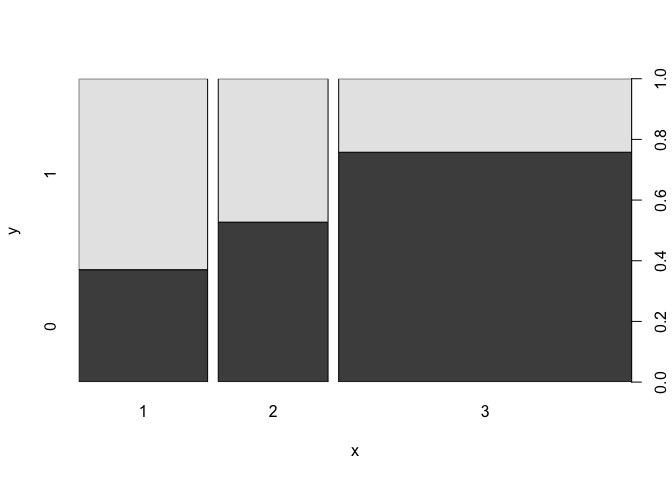 \#\#
Name -&gt; Título

Revisando visualmente el campo **Name**(nombre) observamos que están los
títulos de cada uno de los viajeros. Es decir si son señores, señoras,
señorítas. Lo cual podría ser variable diferenciadora para determinar si
se puede salvar o no.

Para ellos sacaremos el Título según los nombres

``` r
# Cogemos los títulos según los nombres
titanic$Title <- gsub('(.*, )|(\\..*)', '', titanic$Name)
# Presentamos los anteriores títulos enfrentados al género
table(titanic$Sex, titanic$Title)
```

    ##         
    ##          Capt Col Don Dona  Dr Jonkheer Lady Major Master Miss Mlle Mme
    ##   female    0   0   0    1   1        0    1     0      0  260    2   1
    ##   male      1   4   1    0   7        1    0     2     61    0    0   0
    ##         
    ##           Mr Mrs  Ms Rev Sir the Countess
    ##   female   0 197   2   0   0            1
    ##   male   757   0   0   8   1            0

Procedemos a convertir los títulos obtenidos en un grupo más reducido

``` r
# Titulos que vamos a convertir a Mr
toMr_title  <- c ('Don', 'Major', 'Capt', 'Jonkheer', 'Rev', 'Col', 'Sir')
# Convertirmos dichos títulos a Mr
titanic$Title[titanic$Title %in% toMr_title]  <- 'Mr'
# Titulos que vamos a convertir a Mrs
toMrs_title  <- c('the Countess', 'Mme', 'Dona', 'Lady')
# Convertirmos dichos títulos a Mr
titanic$Title[titanic$Title %in% toMrs_title]  <- 'Mrs'
# Titulos que vamos a convertir a Miss
toMiss_title  <- c('Mlle', 'Ms')
# Convertirmos dichos títulos a Miss
titanic$Title[titanic$Title %in% toMiss_title]  <- 'Miss'

# Convertimos los Dr - female en Mrs
titanic$Title[(titanic$Title %in% "Dr") & titanic$Sex == "female"] <- "Mrs"
# Convertimos los Dr - male en Mr
titanic$Title[(titanic$Title %in% "Dr") & titanic$Sex == "male"] <- "Mr"

# Añadimos  el atributo Title
properties <- append(properties, "Title")
# Show title counts by sex again
table(titanic$Sex, titanic$Title)
```

    ##         
    ##          Master Miss  Mr Mrs
    ##   female      0  264   0 202
    ##   male       61    0 782   0

``` r
# Convertimos el campo en factor

titanic$Title <- as.factor(titanic$Title)
```

``` r
# Viajeros según la Titulo
  local({
   .Table <- with(titanic, table(Title))
   cat("\ncounts:\n")
   print(.Table)
   cat("\npercentages:\n")
   print(round(100*.Table/sum(.Table), 2))
   })
```

    ## 
    ## counts:
    ## Title
    ## Master   Miss     Mr    Mrs 
    ##     61    264    782    202 
    ## 
    ## percentages:
    ## Title
    ## Master   Miss     Mr    Mrs 
    ##   4.66  20.17  59.74  15.43

``` r
with(titanic, plot(Title,Survived))
```

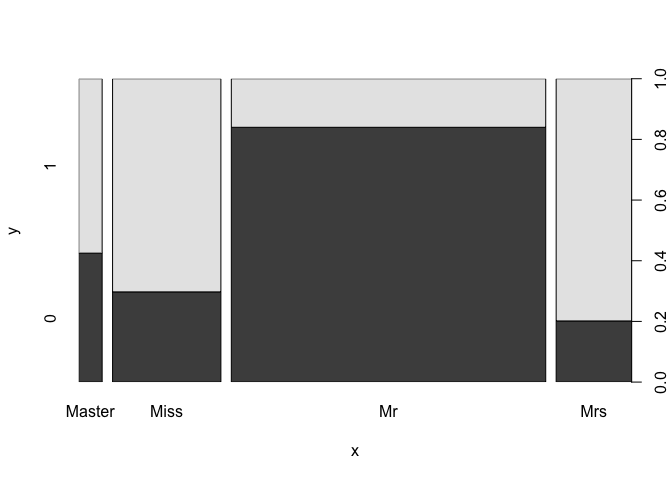

Pero eliminamos el campos **Name** que no parece útil para ninguno de
los posibles modelos.

``` r
# Eliminamos de la variable properties la variable
#titanic$Name <- NULL
properties <- properties[!properties %in% "Name"]
```

Sex
---

El campo **Sex**(género) podría ser útil para nuestros modelos por lo
que lo mantenemos.Y ya está como variable de tipo factor.

``` r
# Viajeros según el género
  local({
   .Table <- with(titanic, table(Sex))
   cat("\ncounts:\n")
   print(.Table)
   cat("\npercentages:\n")
   print(round(100*.Table/sum(.Table), 2))
   })
```

    ## 
    ## counts:
    ## Sex
    ## female   male 
    ##    466    843 
    ## 
    ## percentages:
    ## Sex
    ## female   male 
    ##   35.6   64.4

``` r
with(titanic, plot(Sex,Survived))
```

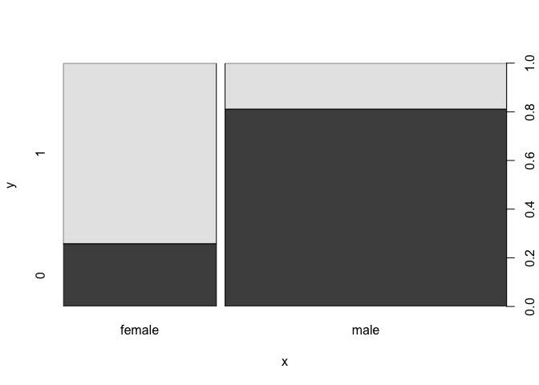

Age
---

El campo **Age**(edad) podría ser útil para nuestros modelos por lo que
lo mantenemos, pero vemos que tiene valores perdídos que estudiaremos en
el siguiente apartado.

``` r
ggplot(titanic, aes(Age, fill = factor(Survived))) + 
  geom_histogram(bins=30) 
```

    ## Warning: Removed 263 rows containing non-finite values (stat_bin).

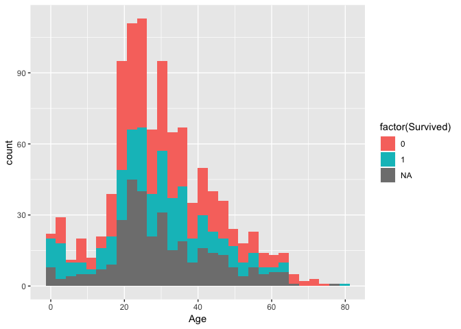

Sibsp, Parch -&gt; Family
-------------------------

Los dos siguientes atributos **Sibsp**(hermanos, pareja) y **Parch**
(padres e hijos) pueden ser interesantes para nuestros modelos, pero
creemos que podría ser válido para nuestros modelos la unión de los dos
en un nuevo campo que sea **Familiy**.

``` r
titanic$Family <- titanic$SibSp + titanic$Parch + 1
properties <- append(properties, "Family")
```

Es un atributo numérico, pero se puede considerar también cualitativo.

``` r
titanic$Family <- as.factor(titanic$Family)
with(titanic, plot(Family,Survived))
```

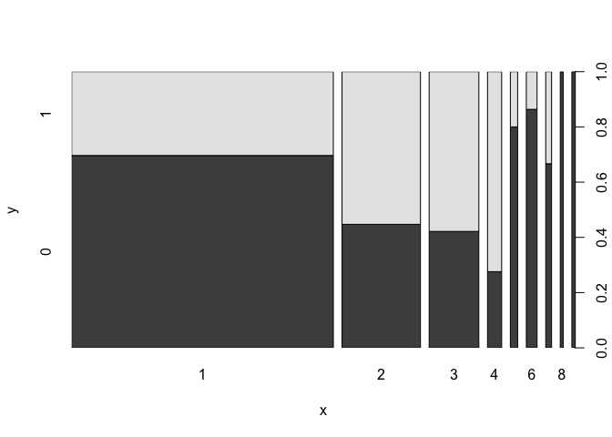 Como
vemos en la gráfica, podemos observar que las familias con más 5 o más
miembros tienen mucha probabilidad de no sobrevivir. Por otra parte los
solteros también tiene alta probabilidad de no sobrevivir y sin embargo
las familias con ménos de 5 miembros tienen alta probabilidad de
sobrevivir.

Por ellos vamos a realizar una agrupación al campo **FamilyType** según
estas agrupaciones.

``` r
titanic$Family <- as.numeric(titanic$Family)
titanic$FamilyType <- 'Regular'
titanic$FamilyType[titanic$Family ==1]  <- 'Single'
titanic$FamilyType[titanic$Family >=5]  <- 'Large'

titanic$FamilyType <- ordered(titanic$FamilyType, c("Single", "Regular", "Large"))

titanic$FamilyType <- as.factor(titanic$FamilyType)
with(titanic, plot(FamilyType,Survived))
```

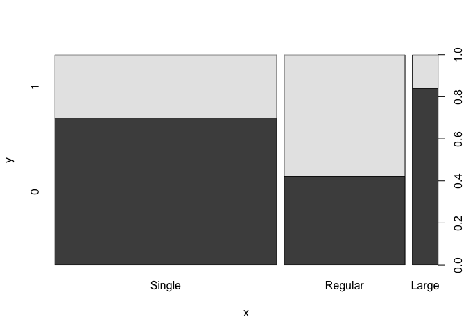 Este
campo nuevo parece bastante interesante para poder discernir si un
viajero tiene posibilidad de sobrevivir o no.

``` r
# Añadimos este campo a la properties
properties = c(properties, "FamilyType")
# Eliminar Family, SibsSPy Parch
properties <- properties[!properties %in% c("Family", "SibSp", "Parch")]
```

Ticket
------

El campo *Ticket* está como tipo characters, aunque no parece un campo
útil, para nuestro modelo, pero vamos a convertirlo en factor, para ver
si puede ser útil.

``` r
titanic$Ticket <- as.factor(titanic$Ticket)
# Hacemos un sumary
summary(titanic)
```

    ##   PassengerId   Survived   Pclass      Name               Sex     
    ##  Min.   :   1   0   :549   1:323   Length:1309        female:466  
    ##  1st Qu.: 328   1   :342   2:277   Class :character   male  :843  
    ##  Median : 655   NA's:418   3:709   Mode  :character               
    ##  Mean   : 655                                                     
    ##  3rd Qu.: 982                                                     
    ##  Max.   :1309                                                     
    ##                                                                   
    ##       Age            SibSp            Parch            Ticket    
    ##  Min.   : 0.17   Min.   :0.0000   Min.   :0.000   CA. 2343:  11  
    ##  1st Qu.:21.00   1st Qu.:0.0000   1st Qu.:0.000   1601    :   8  
    ##  Median :28.00   Median :0.0000   Median :0.000   CA 2144 :   8  
    ##  Mean   :29.88   Mean   :0.4989   Mean   :0.385   3101295 :   7  
    ##  3rd Qu.:39.00   3rd Qu.:1.0000   3rd Qu.:0.000   347077  :   7  
    ##  Max.   :80.00   Max.   :8.0000   Max.   :9.000   347082  :   7  
    ##  NA's   :263                                      (Other) :1261  
    ##       Fare            Cabin             Embarked            Title    
    ##  Min.   :  0.000   Length:1309        Length:1309        Master: 61  
    ##  1st Qu.:  7.896   Class :character   Class :character   Miss  :264  
    ##  Median : 14.454   Mode  :character   Mode  :character   Mr    :782  
    ##  Mean   : 33.295                                         Mrs   :202  
    ##  3rd Qu.: 31.275                                                     
    ##  Max.   :512.329                                                     
    ##  NA's   :1                                                           
    ##      Family        FamilyType 
    ##  Min.   :1.000   Single :790  
    ##  1st Qu.:1.000   Regular:437  
    ##  Median :1.000   Large  : 82  
    ##  Mean   :1.867                
    ##  3rd Qu.:2.000                
    ##  Max.   :9.000                
    ## 

``` r
titanic %>% 
    group_by(Ticket) %>% 
    count()
```

    ## # A tibble: 929 x 2
    ## # Groups:   Ticket [929]
    ##    Ticket     n
    ##    <fct>  <int>
    ##  1 110152     3
    ##  2 110413     3
    ##  3 110465     2
    ##  4 110469     1
    ##  5 110489     1
    ##  6 110564     1
    ##  7 110813     2
    ##  8 111163     1
    ##  9 111240     1
    ## 10 111320     1
    ## # ... with 919 more rows

Como podemos observar de los 1309 hay 1261 tipos distintos de Tickets,
por lo tanto no parece un campo muy relevante y lo eliminamos de nuestro
dataframe.

``` r
# Eliminamos de la variable properties la variable
#titanic$Ticket <- NULL
properties <- properties[!properties %in% "Ticket"]
```

Fare
----

EL campo **Fare**(precio del billete) a priori parece interesante para
un modelo de predicción de si el pasajero sobrevive o no. Vemos que
tiene un valor perdido que también veremos en el próximo apartado.

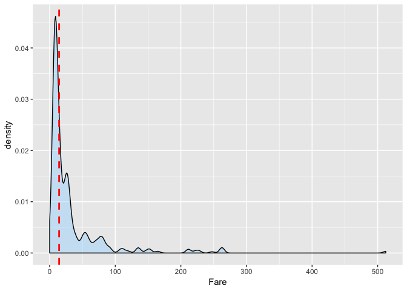
Observamos que hay muchos datos extremos, y nos hace plantearnos que el
campo Fare es el precio del billete y es definido por el número de
personas de dicho ticket.

Cabin -&gt; Deck
----------------

EL campo **Cabin** (nombre del camarote) al igual que pasaba con Ticket
no parece muy interesante para los modelos, pero vamos a factorizar.

``` r
titanic$Cabin <- as.factor(titanic$Cabin)
titanic %>% 
    group_by(Cabin) %>% 
    count()
```

    ## # A tibble: 187 x 2
    ## # Groups:   Cabin [187]
    ##    Cabin     n
    ##    <fct> <int>
    ##  1 ""     1014
    ##  2 A10       1
    ##  3 A11       1
    ##  4 A14       1
    ##  5 A16       1
    ##  6 A18       1
    ##  7 A19       1
    ##  8 A20       1
    ##  9 A21       1
    ## 10 A23       1
    ## # ... with 177 more rows

``` r
# Hacemos un sumary
summary(titanic[properties])
```

    ##  Pclass      Sex           Age             Fare        
    ##  1:323   female:466   Min.   : 0.17   Min.   :  0.000  
    ##  2:277   male  :843   1st Qu.:21.00   1st Qu.:  7.896  
    ##  3:709                Median :28.00   Median : 14.454  
    ##                       Mean   :29.88   Mean   : 33.295  
    ##                       3rd Qu.:39.00   3rd Qu.: 31.275  
    ##                       Max.   :80.00   Max.   :512.329  
    ##                       NA's   :263     NA's   :1        
    ##              Cabin        Embarked            Title       FamilyType 
    ##                 :1014   Length:1309        Master: 61   Single :790  
    ##  C23 C25 C27    :   6   Class :character   Miss  :264   Regular:437  
    ##  B57 B59 B63 B66:   5   Mode  :character   Mr    :782   Large  : 82  
    ##  G6             :   5                      Mrs   :202                
    ##  B96 B98        :   4                                                
    ##  C22 C26        :   4                                                
    ##  (Other)        : 271

En el resumen vemos que hay 271 tipos de cabinas, por lo que parecería
interesante ya que se agruparían muchos pasajeros, pero uno de los
grupos contiene 1014 pasajeros. Por esto parece que no es muy
interesante pero agruparlos por las cubiertas de la cabina, para ver si
es interesante dicha propiedad

``` r
titanic$Cabin <- as.character(titanic$Cabin)
titanic$Deck<-sapply(titanic$Cabin, function(x) strsplit(x, NULL)[[1]][1])
titanic$Deck[is.na(titanic$Deck)] <- "No Cabin"
titanic$Deck <- as.factor(titanic$Deck)
with(titanic, plot(Deck,Survived))
```

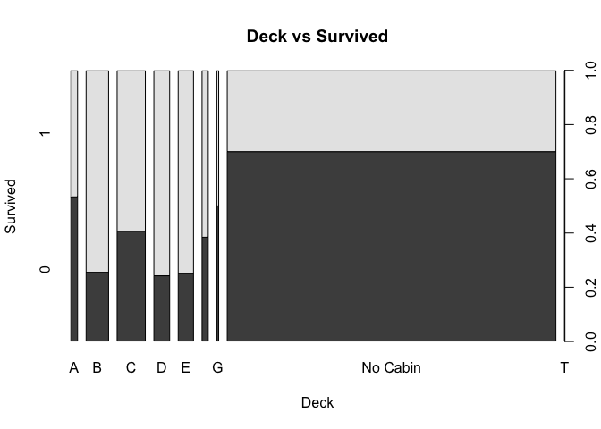 Este propiedad
parece más interesante, porque hay una probabilidad de 70% que si un
pasajero no tuviera cabina, no sobreviviese.

``` r
# Eliminamos de la variable properties la variable
#titanic$Cabin <- NULL
properties <- properties[!properties %in% "Cabin"]
# Añadimos la variable Deck
properties <- c(properties, "Deck")
```

Embarked
--------

El último campo **Embarked**(puerto de embarque) es de tipo texto y lo
pasamos a factor para ver si puede resultar interesante.

``` r
titanic$Embarked <- as.factor(titanic$Embarked)
titanic %>% 
    group_by(Embarked) %>% 
    count() 
```

    ## # A tibble: 4 x 2
    ## # Groups:   Embarked [4]
    ##   Embarked     n
    ##   <fct>    <int>
    ## 1 ""           2
    ## 2 C          270
    ## 3 Q          123
    ## 4 S          914

De la agrupación vermos que tenemos 4 niveles y uno de ello es valor
perdido, que estudiaremos en el próximo apartado.

Si analizamos los datos del embarque

``` r
# Viajeros según el embarque
  local({
   .Table <- with(titanic, table(Embarked))
   cat("\ncounts:\n")
   print(.Table)
   cat("\npercentages:\n")
   print(round(100*.Table/sum(.Table), 2))
   })
```

    ## 
    ## counts:
    ## Embarked
    ##       C   Q   S 
    ##   2 270 123 914 
    ## 
    ## percentages:
    ## Embarked
    ##           C     Q     S 
    ##  0.15 20.63  9.40 69.82

``` r
with(titanic, plot(Embarked,Survived))
```

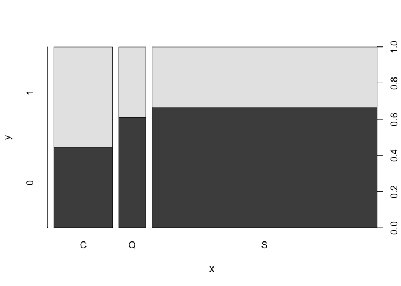

De la gráfica podemos observar que parece que dependiendo de donde se
realizase el embarque, hay variación de la probabilidad de sobrevivir
por lo que parece un campo interesante de estudio.

Limpieza de los datos.
======================

Valores vacios o que continen 0
-------------------------------

Como hemos visto en el apartado anterior de nuestras propiedades
numéricas tenemos valores nulos en **Age** y **Fare** y de tipo factor
en *Embarked*.

### Valor *Fare* con valor NA

Buscamos el único valor que contiene NA en su propiedad *Fare*

``` r
titanic %>% filter(is.na(titanic$Fare))
```

    ##   PassengerId Survived Pclass               Name  Sex  Age SibSp Parch
    ## 1        1044     <NA>      3 Storey, Mr. Thomas male 60.5     0     0
    ##   Ticket Fare Cabin Embarked Title Family FamilyType     Deck
    ## 1   3701   NA              S    Mr      1     Single No Cabin

De este pasajero observamos que su embarque fué en *Southampton* (‘S’) y
es de tercera clase, que parece propiedades que determinarían el precio
del embarque.

``` r
ggplot(titanic[titanic$Pclass == '3' & titanic$Embarked == 'S', ], 
  aes(x = Fare)) +
  # Función de densidad de los valores de Fare filtrados
  geom_density(fill = '#99d6ff', alpha=0.4, na.rm=T) + 
  # Dibujamos la recta de la mediana
  geom_vline(aes(xintercept=median(Fare, na.rm=T)),
    colour='red', linetype='dashed', lwd=1) 
```

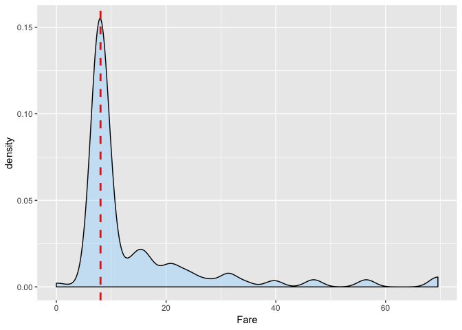

De esta visualización vemos que la mayoría de los valores se concentran
cerca de la mediana, por lo que parece razonable sustituir el valor
perdido con el valor de la mediana del grupo que corresponde con la
misma clase y el mismo embarque.

``` r
# Reemplazamos el valor perdido con el valor de la mediana
titanic$Fare[1044] <- median(titanic[titanic$Pclass == '3' & titanic$Embarked == 'S', ]$Fare, na.rm = TRUE)
sprintf ("Valor Fare reemplazado: %s", titanic$Fare[1044])
```

    ## [1] "Valor Fare reemplazado: 8.05"

### Valor *Age* con valor NA

Como hemos visto los valores perdidos del atributo *Age* es de 263 que
frente al total suponen un 20% que es una gran cantidad de valores
perdidos.

``` r
summary(titanic %>% select(properties) %>% filter(is.na(Age)))
```

    ##  Pclass      Sex           Age           Fare        Embarked    Title    
    ##  1: 39   female: 78   Min.   : NA   Min.   :  0.00    :  0    Master:  8  
    ##  2: 16   male  :185   1st Qu.: NA   1st Qu.:  7.75   C: 58    Miss  : 51  
    ##  3:208                Median : NA   Median :  8.05   Q: 73    Mr    :177  
    ##                       Mean   :NaN   Mean   : 19.82   S:132    Mrs   : 27  
    ##                       3rd Qu.: NA   3rd Qu.: 22.80                        
    ##                       Max.   : NA   Max.   :227.53                        
    ##                       NA's   :263                                         
    ##    FamilyType        Deck    
    ##  Single :200   No Cabin:240  
    ##  Regular: 48   C       :  8  
    ##  Large  : 15   D       :  4  
    ##                A       :  3  
    ##                E       :  3  
    ##                F       :  3  
    ##                (Other) :  2

Al ser un gran úmnero de valores, no podemos permitirnos elmininar
dichos datos.

Para ello tenemos que imputar los posibles valores. Para ellos
utilizaremos dos modelos uno el K vecinos y otro con un Random-forest
según la biblioteca mice orientada para obtener rellenear valores
vacios.

Primero con el KNN de la libería VIM.

``` r
# La función kNN genera una nueva columna lógica que
# indica si se han imputado valores o no
mod_knn <- kNN(titanic, variable = ("Age"))
```

Con un Random Forest con la librería mice.

``` r
set.seed(129)
mice_mod <- mice(titanic[, !names(titanic) %in% c('PassengerId','Name','Ticket','Cabin','Survived')], method='rf') 
```

    ## 
    ##  iter imp variable
    ##   1   1  Age
    ##   1   2  Age
    ##   1   3  Age
    ##   1   4  Age
    ##   1   5  Age
    ##   2   1  Age
    ##   2   2  Age
    ##   2   3  Age
    ##   2   4  Age
    ##   2   5  Age
    ##   3   1  Age
    ##   3   2  Age
    ##   3   3  Age
    ##   3   4  Age
    ##   3   5  Age
    ##   4   1  Age
    ##   4   2  Age
    ##   4   3  Age
    ##   4   4  Age
    ##   4   5  Age
    ##   5   1  Age
    ##   5   2  Age
    ##   5   3  Age
    ##   5   4  Age
    ##   5   5  Age

``` r
mice_output <- complete(mice_mod)
```

Después de obtener los valores, con los dos métodos, representamos la
función densidad, y la comparamos con los datos originales. Para
valorar, como varía la función densidad de los datos con las
imputaciones realizadas.

``` r
# Función densidad de la Edad con los datos original
Age_original <- ggplot(titanic, 
  aes(x = Age)) +
  # Función de densidad de los valores de Age filtrados
  geom_density(fill = '#99d6ff', alpha=0.4, na.rm=T) + 
  # Dibujamos la recta de la mediana
  geom_vline(aes(xintercept=median(Age, na.rm=T)),
    colour='red', linetype='dashed', lwd=1) 
# Función densidad de la Edad con los datos completados con Knn
Age_knn <- ggplot(mod_knn, 
  aes(x = Age)) +
  # Función de densidad de los valores de Age filtrados
  geom_density(fill = '#99d600', alpha=0.4, na.rm=T) + 
  # Dibujamos la recta de la mediana
  geom_vline(aes(xintercept=median(Age, na.rm=T)),
    colour='red', linetype='dashed', lwd=1) 

# Función densidad de la Edad con los datos completados con Random-Forest según la libería mice

Age_rf <- ggplot(mice_output, 
  aes(x = Age)) +
  # Función de densidad de los valores de Age filtrados
  geom_density(fill = '#ff0f55', alpha=0.4, na.rm=T) + 
  # Dibujamos la recta de la mediana
  geom_vline(aes(xintercept=median(Age, na.rm=T)),
    colour='red', linetype='dashed', lwd=1) 

figure <- ggarrange(Age_original, Age_knn, Age_rf,
                    labels = c("Original", "Knn", "Random-Forest"),
                    ncol = 1, nrow =3)
figure
```

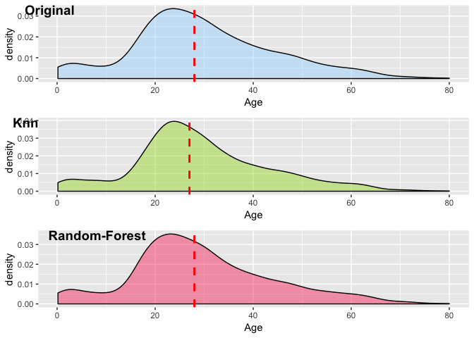

De la gráficas, observamos como el método **Random-Forest** obtiene una
gráfica de densidad de la Edad muy parecida a la muestra original sin
tener en cuenta los valores perdidos y la mediana no varía Sin embargo,
con el método **Knn** obtenemos una gráfica más distorsionada e incluso
la mediana se desplaza un poco. Por lo que procedemos a remplazar en
nuestro dataframe los datos obtenidos con el método **Random-Forest** en
los valores perdidos

``` r
# Reemplazamos los datos de la edad en nuestro dataframe original
titanic[,"Age"] <- mice_output$Age
```

### Valor *Embarked* con valor vacio

Presentamos los valores con embarque vacio

``` r
titanic %>% filter(Embarked == "")
```

    ##   PassengerId Survived Pclass                                      Name
    ## 1          62        1      1                       Icard, Miss. Amelie
    ## 2         830        1      1 Stone, Mrs. George Nelson (Martha Evelyn)
    ##      Sex Age SibSp Parch Ticket Fare Cabin Embarked Title Family
    ## 1 female  38     0     0 113572   80   B28           Miss      1
    ## 2 female  62     0     0 113572   80   B28            Mrs      1
    ##   FamilyType Deck
    ## 1     Single    B
    ## 2     Single    B

Observamos que las instancias que tienen el embarque vacio son de la
Clase 1 y tienen un precio de embarque de 80. Para ver como se
distribuyen los precios de los embarques representamos los *boxplot* de
la población según los embarques, descartando los elementos que tienen
embarque vacio

``` r
# Eliminamos de la población los que tiene embarque vacio
embark_fare <- titanic %>%
  filter(PassengerId != 62 & PassengerId != 830 & Pclass==1)
# Repesentamos los boxplot y una línea roja con el valor del precio del pasaje de los valores perdidos
ggplot(embark_fare, aes(x = Embarked, y = Fare)) +
  geom_boxplot() +
  geom_hline(aes(yintercept=80), 
    colour='red', linetype='dashed', lwd=2) 
```

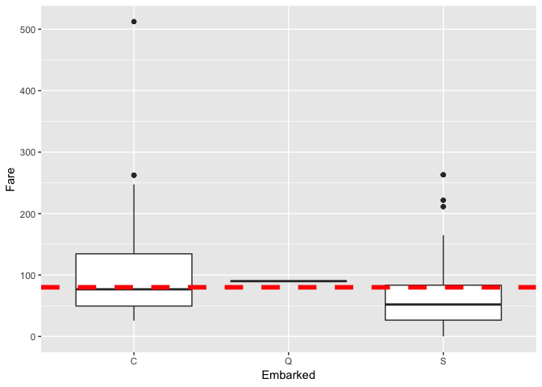

Como vemos la mediana de un embarque en Charbourg (‘C’) de primera clase
coincide con el precio de 80 de la instancia que desconocemos el
embarque por lo que parece razonable reemplazarlo por el valor de
Charbourg

``` r
titanic$Embarked[titanic$Embarked==""] <- "C"
titanic$Embarked <- as.factor(as.character(titanic$Embarked))
```

Identificación y tratamiento de valores externos
------------------------------------------------

Para detectar la presencia de valores atípicos examinaremos primero el
resumen de los cinco números de Tukey, donde podremos observar un
análisis descriptivo de los datos

Para obtener los datos sólo utilizaremos las variables numéricas
**Age**, **Fare**, y la calculada **Family** a partir de **SibSp**,
**Parch**.

``` r
numeric_properties <- c ("Age",  "Fare", "Family")
summary(titanic %>% select(numeric_properties))
```

    ##       Age             Fare             Family     
    ##  Min.   : 0.17   Min.   :  0.000   Min.   :1.000  
    ##  1st Qu.:21.00   1st Qu.:  7.896   1st Qu.:1.000  
    ##  Median :28.00   Median : 14.454   Median :1.000  
    ##  Mean   :29.62   Mean   : 33.276   Mean   :1.867  
    ##  3rd Qu.:38.00   3rd Qu.: 31.275   3rd Qu.:2.000  
    ##  Max.   :80.00   Max.   :512.329   Max.   :9.000

Los cinco números también se representan gráficamente con **boxplot**

``` r
sapply(titanic[numeric_properties], boxplot.stats)
```

    ##       Age        Fare        Family     
    ## stats Numeric,5  Numeric,5   Numeric,5  
    ## n     1309       1309        1309       
    ## conf  Numeric,2  Numeric,2   Numeric,2  
    ## out   Numeric,26 Numeric,171 Numeric,125

### Age

Para estudiar los valores extremos dibujamos el boxplot de la propiedad

``` r
Age_boxplot <- ggplot(titanic, aes(x="", y=Age) ) +
  geom_boxplot() 
Age_boxplot
```

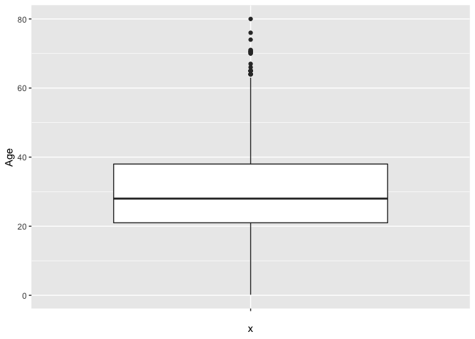

De la gráfica, observamos que la mayoría de la población se encuentra
entre 0 y 60 años aproximadamente. Pero hay pasajeros que se encuentra
entre los 60 y los 80 años. Por lo que no parece que hay errores
tipográficos, y parecen valores razonables ya que no hay ninguna edad
que pueda ser considerada erronea.

``` r
titanic$AgeType[titanic$Age < 18] <- "Child"
titanic$AgeType[titanic$Age >= 18 & titanic$Age < 65] <- "Adult"
titanic$AgeType[titanic$Age >= 65] <- "Elder"
titanic$AgeType <- ordered(titanic$AgeType, c("Child", "Adult", "Elder"))
```

``` r
# Viajeros según el embarque
  local({
   .Table <- with(titanic, table(AgeType))
   cat("\ncounts:\n")
   print(.Table)
   cat("\npercentages:\n")
   print(round(100*.Table/sum(.Table), 2))
   })
```

    ## 
    ## counts:
    ## AgeType
    ## Child Adult Elder 
    ##   189  1100    20 
    ## 
    ## percentages:
    ## AgeType
    ## Child Adult Elder 
    ## 14.44 84.03  1.53

``` r
with(titanic, plot(AgeType,Survived))
```

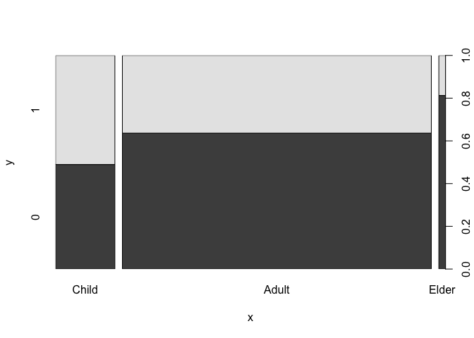

``` r
#Eliminaos la propiedad Age
properties <- properties[!properties %in% "Age"]
# Añadimos la variable Deck
properties <- c(properties, "AgeType")
```

### Fare

``` r
Fare_boxplot <- ggplot(titanic, aes(x="", y=Fare)) +
  geom_boxplot() 
Fare_boxplot
```

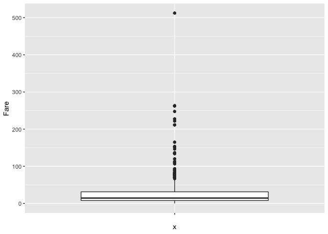 De las
observación de las gráficas, no podemos observar valores extremos que se
puedan considerar erroneos. Pero parece razonable que los precios
corresponda con el tipo de clase. Por lo que ahora haremos un gráfico de
boxplot catalogados por clase.

``` r
Fare_boxplot_Pclass <- ggplot(titanic, aes(x=Pclass, y=Fare)) +
  geom_boxplot() 
Fare_boxplot_Pclass
```

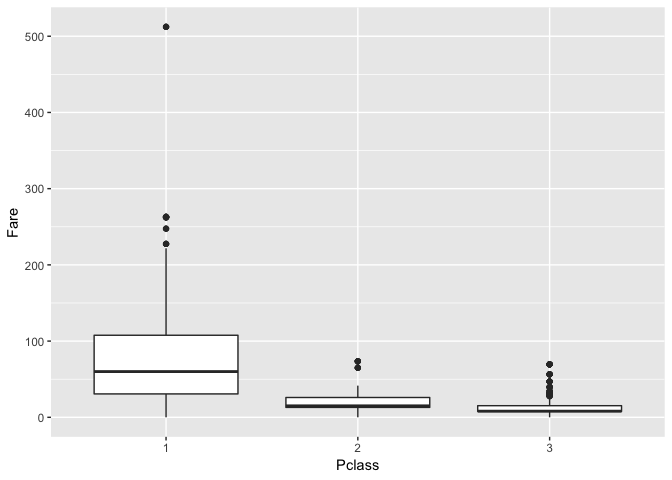

Para verificar, los valores extremos podemos calcular el precio por
persona y relacionarlo con la clase.

``` r
# Calculamos el número de pasajeros por ticket
titanic$person_per_ticket <- sapply(titanic$Ticket,
                      function(x) nrow(subset(titanic, Ticket==x)))
# Calculamos el precio por pasajero
titanic$Fare_per_person=titanic$Fare/titanic$person_per_ticket
```

``` r
# Representams el boxplot del precio por pasajero frente a la clase
Fare_per_person_boxplot_Pclass <- ggplot(titanic, aes(x=Pclass, y=Fare_per_person)) +
  geom_boxplot() 
Fare_per_person_boxplot_Pclass
```

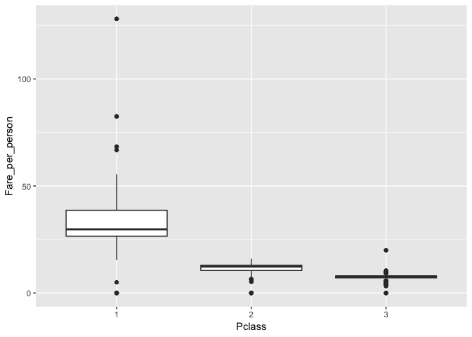

En esta gráfica del precio por persona del billete, observamos una mayor
diferencia de los precios por la clase del billete. Aun habiendo precios
que son valores extremos, se puede ver que los rangos por cada clase son
razonables. Ya que por el precio del billete en el mayoría de los casos
se podría determinar a que clase pertenece.

Por lo que parece más razonable utilizar esta variable calculada
**Fare\_per\_person** que la original.

### Family

``` r
Family_boxplot <- ggplot(titanic, aes(x="", y=Family)) +
  geom_boxplot() 
Family_boxplot
```

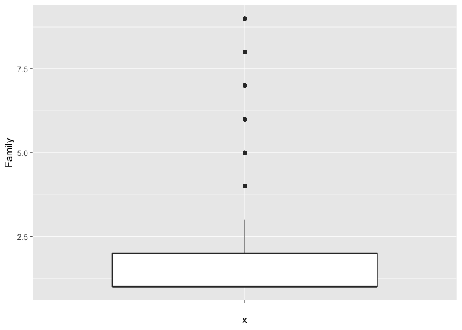

De los datos observamos que hay valore extremos, pero estos valores no
parecen erroneos ya que la mayoría de los pasajeros son solteros y hay
distintos tipos de familia que van desde los dos miembros hasta los 11
miembros de familia numerosa. Por tanto nuestro campo **FamilyType**
calculado también es correcto.

Análisis de los datos.
======================

Selección de los grupos de datos que se quieren analizar/comparar
-----------------------------------------------------------------

En nuestro caso, el objetivo es detectar las variables que más
contribuyen a explicar si un viajero va a sobrevivir o no, por lo que
tendremos que generar un modelo predictivo y/o de clasificación para
ubicar a un viajeros según alguna de sus características.

Nuestro dataset ya se nos ha dado en dos conjuntos, uno para estudio y
otro para dar solución al problema que se plantea en Kaggle. Estos son
los que tenemos un valor en la clase de salidad **Survived**.

Para hacer el estudio separaremos el primer conjunto en dos uno para
entrenamiento y otro para test. La separación la realizaremos en 80%
para training y 20% para test. Y el tercer grupo será para dar los
resultado .

``` r
# Separamos los datos
notsubmission <- titanic %>% filter(not(is.na(Survived)))
index <- createDataPartition(notsubmission$PassengerId, p = 0.8, list = FALSE)

train <- notsubmission[index,]
test <- notsubmission[-index,]

rownames(train) <- train$PassengerId
rownames(test) <- test$PassengerId


# Datos de  entrega
submission <- titanic %>% filter(is.na(Survived))
rownames(submission) <- submission$PassengerId
```

Comprobación de la normalidad y homogeneidad de la varianza.
------------------------------------------------------------

Para el estudio de la normalidad y homogeneidad de la varianza en
nuestro conjunto utilizaremos el test de normalidad de Anderson-Darling,
que básicamente realiza el siguiente contraste de hipótesis:

-   H0: No hay diferencias observables entre los datos y la distribución
    normal
-   H1: Existen diferencias observables entre los datos y la
    distribución normal

``` r
sapply(train[c(numeric_properties)], ad.test)
```

    ##           Age                              
    ## statistic 6.072157                         
    ## p.value   6.154997e-15                     
    ## method    "Anderson-Darling normality test"
    ## data.name "X[[i]]"                         
    ##           Family                           
    ## statistic 92.53231                         
    ## p.value   3.7e-24                          
    ## method    "Anderson-Darling normality test"
    ## data.name "X[[i]]"                         
    ##           Fare_per_person                  
    ## statistic 78.14322                         
    ## p.value   3.7e-24                          
    ## method    "Anderson-Darling normality test"
    ## data.name "X[[i]]"

Si nos fijamos en los valores de p de todos los atributos y asignamos el
valor de significación de 0,05 , observamos que todos ellos son valores
muy por debajo del valor de significación. Por tanto no se puede aceptar
la hipótesis nula. Por lo que podemos afirmar con un 95 % de fiabilidad
que **los datos no siguen una distribución normal**.

Podríamos también aplicar el test de normalidad de Shapiro-Wilk.

``` r
sapply(train[c(numeric_properties)], shapiro.test)
```

    ##           Age                           Family                       
    ## statistic 0.9735389                     0.6408939                    
    ## p.value   4.438106e-10                  3.887125e-36                 
    ## method    "Shapiro-Wilk normality test" "Shapiro-Wilk normality test"
    ## data.name "X[[i]]"                      "X[[i]]"                     
    ##           Fare_per_person              
    ## statistic 0.6480683                    
    ## p.value   7.215247e-36                 
    ## method    "Shapiro-Wilk normality test"
    ## data.name "X[[i]]"

Observando igualmente que nuestros valores **no siguen una distribución
normal**.

Como ninguna de nuestras variables siguen una distribución normal, para
realizar el estudio la homogeneidad de las varianzas, utilizaremos el
test de Fligner-Killeen, que compara las varianzas basándose en la
mediana. Donde -H0: la varianza es igual entre los grupos -H1: la
varianza no es igual entre los grupos

``` r
train$SurvivedNumeric <- 0 
train$SurvivedNumeric[train$Survived ==1]<- 1
test$SurvivedNumeric <- 0 
test$SurvivedNumeric[test$Survived ==1]<- 1
fligner.test(SurvivedNumeric ~ Family, data = train)
```

    ## 
    ##  Fligner-Killeen test of homogeneity of variances
    ## 
    ## data:  SurvivedNumeric by Family
    ## Fligner-Killeen:med chi-squared = 21.76, df = 8, p-value = 0.00538

A un 95% de confianza la varianzas **no son iguales** entre los grupos

``` r
fligner.test(SurvivedNumeric ~ Fare_per_person, data = train)
```

    ## 
    ##  Fligner-Killeen test of homogeneity of variances
    ## 
    ## data:  SurvivedNumeric by Fare_per_person
    ## Fligner-Killeen:med chi-squared = 190.66, df = 208, p-value =
    ## 0.8001

A un 95% de confianza la varianzas \*\* son iguales\*\* entre los grupos

``` r
fligner.test(SurvivedNumeric ~ Age, data = train)
```

    ## 
    ##  Fligner-Killeen test of homogeneity of variances
    ## 
    ## data:  SurvivedNumeric by Age
    ## Fligner-Killeen:med chi-squared = 56.213, df = 83, p-value =
    ## 0.9894

A un 95% de confianza la varianzas **son iguales** entre los grupos

Aplicación de pruebas estadísticas para comparar los grupos de dato
-------------------------------------------------------------------

Para el siguiente estudio nos quedaremos con las propiedades Pclass,
Sex, AgeType, Embarked , Title, FamilyType, Deck, Fare\_per\_person.

De las cuales una es numéricas Fare\_per\_person y el resto son
categóricas

Aunque podríamos utilizar otras dos variables que serían Family o Age si
el modelo requiera valores numéricos.

### Análisis de correlacción

Nuestra primera prueba estadística será la de estudiar cuál de nuestras
variables tiene mayor repercusión sobre la variable dependiente. Para
hacer el análisis utilizaremos las variables numéricos Family, Age y
Fare\_per\_person y las categóricas Pclass, Sex, Embarked y title. Para
realizar el análisis de correlación tendremos que crear variables
dummies para las variables categócias. Utilizaremos el coeficiente de
correlación de pearson y un nivel de corte de correlación de 0.7.

``` r
train_CM <-  dummy.data.frame(train[c("SurvivedNumeric","Pclass", "Sex", "Embarked", "Title","Family" ,"Deck", "Age"      , "Fare_per_person")], sep = ".")

test_CM <-  dummy.data.frame(test[c("SurvivedNumeric","Pclass", "Sex", "Embarked", "Title","Family" ,"Deck", "Age"      , "Fare_per_person")], sep = ".")

CM <- cor(train_CM)
highlyCorrelated <-  findCorrelation(CM, cutoff = 0.7 , names = TRUE)
c(highlyCorrelated)
```

    ## [1] "Pclass.1"   "Title.Mr"   "Sex.female" "Embarked.C"

Como vemos las variables es más correladas están son todas categóricas.

### Modelo de regresión lineal (logit)

Crearemos un modelo de regresión lineal con los predictores anteriores,
usando el conjunto de entrenamiento (*train*). Para su evaluación, se
usará el *test*. Como son categóricas utilizaremos con base los
elementos que tenemos mayor correlación.

``` r
logitMod <- glm(SurvivedNumeric ~ Pclass.1 + Pclass.2 + Title.Mr + Title.Miss  + Title.Mrs + Sex.female + Embarked.C + Embarked.Q , data=train_CM, family=binomial(link="logit"))

summary(logitMod)
```

    ## 
    ## Call:
    ## glm(formula = SurvivedNumeric ~ Pclass.1 + Pclass.2 + Title.Mr + 
    ##     Title.Miss + Title.Mrs + Sex.female + Embarked.C + Embarked.Q, 
    ##     family = binomial(link = "logit"), data = train_CM)
    ## 
    ## Deviance Residuals: 
    ##     Min       1Q   Median       3Q      Max  
    ## -2.2174  -0.5968  -0.3387   0.6407   2.4029  
    ## 
    ## Coefficients: (1 not defined because of singularities)
    ##             Estimate Std. Error z value Pr(>|z|)    
    ## (Intercept)  -0.1173     0.3740  -0.314    0.754    
    ## Pclass.1      2.1038     0.2778   7.572 3.66e-14 ***
    ## Pclass.2      1.1945     0.2699   4.425 9.62e-06 ***
    ## Title.Mr     -2.7123     0.4062  -6.678 2.42e-11 ***
    ## Title.Miss    0.3823     0.4150   0.921    0.357    
    ## Title.Mrs     0.4020     0.4431   0.907    0.364    
    ## Sex.female        NA         NA      NA       NA    
    ## Embarked.C    0.6669     0.2655   2.512    0.012 *  
    ## Embarked.Q    0.2267     0.3621   0.626    0.531    
    ## ---
    ## Signif. codes:  0 '***' 0.001 '**' 0.01 '*' 0.05 '.' 0.1 ' ' 1
    ## 
    ## (Dispersion parameter for binomial family taken to be 1)
    ## 
    ##     Null deviance: 954.63  on 714  degrees of freedom
    ## Residual deviance: 606.53  on 707  degrees of freedom
    ## AIC: 622.53
    ## 
    ## Number of Fisher Scoring iterations: 5

Vemos que estadísticamente los más relevantes son las Clase 1 y 2 junto
con el título de Mr.

Se hace notar que la variable Sex.female no está definida. Esto es
consecuencia en que hay otra variable que está altamente relacionada con
Sex. Si presentamos los datos de la matriz de correlación vemos que hay
una correlación alta con Tittle.Mr.

``` r
CM["Sex.female",]
```

    ## SurvivedNumeric        Pclass.1        Pclass.2        Pclass.3 
    ##     0.555109698     0.089976752     0.055807205    -0.122805894 
    ##      Sex.female        Sex.male      Embarked.C      Embarked.Q 
    ##     1.000000000    -1.000000000     0.109456625     0.076331469 
    ##      Embarked.S    Title.Master      Title.Miss        Title.Mr 
    ##    -0.144300245    -0.167374519     0.686610625    -0.900929299 
    ##       Title.Mrs          Family          Deck.A          Deck.B 
    ##     0.565502477     0.186502406    -0.078483539     0.084506172 
    ##          Deck.C          Deck.D          Deck.E          Deck.F 
    ##     0.071156587     0.081196295     0.041242601    -0.005227389 
    ##          Deck.G   Deck.No Cabin          Deck.T             Age 
    ##     0.087985449    -0.124004256    -0.027609635    -0.101106233 
    ## Fare_per_person 
    ##     0.101470387

Por lo que podríamos eliminar una de las dos variables. Por ejemplo
Sex.female

``` r
logitMod <- glm(SurvivedNumeric ~ Pclass.1 + Pclass.2 + Title.Mr + Title.Miss  + Title.Mrs  + Embarked.C + Embarked.Q , data=train_CM, family=binomial(link="logit"))

summary(logitMod)
```

    ## 
    ## Call:
    ## glm(formula = SurvivedNumeric ~ Pclass.1 + Pclass.2 + Title.Mr + 
    ##     Title.Miss + Title.Mrs + Embarked.C + Embarked.Q, family = binomial(link = "logit"), 
    ##     data = train_CM)
    ## 
    ## Deviance Residuals: 
    ##     Min       1Q   Median       3Q      Max  
    ## -2.2174  -0.5968  -0.3387   0.6407   2.4029  
    ## 
    ## Coefficients:
    ##             Estimate Std. Error z value Pr(>|z|)    
    ## (Intercept)  -0.1173     0.3740  -0.314    0.754    
    ## Pclass.1      2.1038     0.2778   7.572 3.66e-14 ***
    ## Pclass.2      1.1945     0.2699   4.425 9.62e-06 ***
    ## Title.Mr     -2.7123     0.4062  -6.678 2.42e-11 ***
    ## Title.Miss    0.3823     0.4150   0.921    0.357    
    ## Title.Mrs     0.4020     0.4431   0.907    0.364    
    ## Embarked.C    0.6669     0.2655   2.512    0.012 *  
    ## Embarked.Q    0.2267     0.3621   0.626    0.531    
    ## ---
    ## Signif. codes:  0 '***' 0.001 '**' 0.01 '*' 0.05 '.' 0.1 ' ' 1
    ## 
    ## (Dispersion parameter for binomial family taken to be 1)
    ## 
    ##     Null deviance: 954.63  on 714  degrees of freedom
    ## Residual deviance: 606.53  on 707  degrees of freedom
    ## AIC: 622.53
    ## 
    ## Number of Fisher Scoring iterations: 5

Para obtener una métrica del modelo según los datos de entrenamiento

``` r
logitModPredTrain <- predict(logitMod, type = "response")
logitCMTrain <- table(train_CM$Survived, logitModPredTrain >= 0.5)
logitCMTrain
```

    ##    
    ##     FALSE TRUE
    ##   0   372   66
    ##   1    72  205

``` r
logitAccuracy <- local( function(table) { 
  total <- table[1,1] +table[1,2]+table[2,1]+table[2,2]
  accuracy <- (table[2,2]+ table[1,1]) / total
  accuracy
})
logitSensitivity <- local( function(table) { 
  sensitivity <- table[2,2] / (table[2,2] + table[2,1])
  sensitivity
})
logitSpecificity <- local( function(table) { 
  specificity <- table[1,1] / (table[1,1] + table[1,2])
  specificity
})  

logit_accuracy_train <- logitAccuracy(logitCMTrain)
cat ("Accuracy train:" , logit_accuracy_train)
```

    ## Accuracy train: 0.806993

``` r
logitModPredTest <- predict(logitMod, type = "response", newdata = test_CM)
logitCMTest <-table(test_CM$Survived, logitModPredTest >= 0.5)
logitCMTest
```

    ##    
    ##     FALSE TRUE
    ##   0    92   19
    ##   1    21   44

``` r
logit_accuracy_test <- logitAccuracy(logitCMTest)
cat ("Accuracy test:" , logit_accuracy_test)
```

    ## Accuracy test: 0.7727273

### Modelo de clasificación con Random-forest

Como la mayoría de las variables que tenemos las hemos categorizado, una
modelo de clasificación que podríamos optar es por un Random-forest.

``` r
x_rf_train <- train[c(properties)]
y_rf_train <- train$Survived
rf <- C50::C5.0( x_rf_train, y_rf_train)
summary(rf)
```

    ## 
    ## Call:
    ## C5.0.default(x = x_rf_train, y = y_rf_train)
    ## 
    ## 
    ## C5.0 [Release 2.07 GPL Edition]      Fri May 31 22:42:19 2019
    ## -------------------------------
    ## 
    ## Class specified by attribute `outcome'
    ## 
    ## Read 715 cases (9 attributes) from undefined.data
    ## 
    ## Decision tree:
    ## 
    ## Title = Mr: 0 (428/66)
    ## Title in {Master,Miss,Mrs}:
    ## :...FamilyType in [Single-Regular]: 1 (248/45)
    ##     FamilyType = Large:
    ##     :...Pclass in {1,2}: 1 (5)
    ##         Pclass = 3: 0 (34/3)
    ## 
    ## 
    ## Evaluation on training data (715 cases):
    ## 
    ##      Decision Tree   
    ##    ----------------  
    ##    Size      Errors  
    ## 
    ##       4  114(15.9%)   <<
    ## 
    ## 
    ##     (a)   (b)    <-classified as
    ##    ----  ----
    ##     393    45    (a): class 0
    ##      69   208    (b): class 1
    ## 
    ## 
    ##  Attribute usage:
    ## 
    ##  100.00% Title
    ##   40.14% FamilyType
    ##    5.45% Pclass
    ## 
    ## 
    ## Time: 0.0 secs

Como vemos el error es de casi un 16%, teniendo una precisión del 84%
que es bastante bueno.

También observamos que los falsos negativos, es decir personas que
nuestro modelo determina que no sobrevive, pero si lo hace es de 39 que
no supone ni un 5%. Los falsos positivos, es un poco más alto llegando
al 11%.

Ahora hacemos la predicción

``` r
x_rf_test <- test[properties]
y_rf_test = predict(rf, newdata = x_rf_test)
x_rf_test$Survived<- y_rf_test
```

### SVM

Otro modelo que podemos utilizar para predecir la supervivencia de un
viajero sería SVM ( Support Vector Machine). Como la mayoría de nuestras
propiedades son categóricas tendríamos que utilizar un valor dummy para
aquellas que no la hayamos obtenido de la numérica. Para el caso de Age
y Family utilizaremos la versión numérica en vez de la categórica

``` r
train_SVM <- dummy.data.frame(train[c("Pclass", "Sex", "Age", "Embarked" , "Title", "Family", "Deck", "Fare_per_person")], sep = ".")
train_SVM$Survived <- train$Survived
```

``` r
trainControl <- trainControl(method="repeatedcv", number=10, repeats=3)
metric <- "Accuracy"
grid <- expand.grid(.sigma=c(0.025, 0.05, 0.1, 0.15), .C=seq(1, 10, by=1))
fit.svm <- train(Survived~., data=train_SVM, method="svmRadial", metric=metric, tuneGrid=grid,
preProc=c("BoxCox"), trControl=trainControl, scale = FALSE )
print(fit.svm)
```

    ## Support Vector Machines with Radial Basis Function Kernel 
    ## 
    ## 715 samples
    ##  24 predictor
    ##   2 classes: '0', '1' 
    ## 
    ## Pre-processing: Box-Cox transformation (2) 
    ## Resampling: Cross-Validated (10 fold, repeated 3 times) 
    ## Summary of sample sizes: 644, 644, 643, 643, 644, 643, ... 
    ## Resampling results across tuning parameters:
    ## 
    ##   sigma  C   Accuracy   Kappa    
    ##   0.025   1  0.8024449  0.5895317
    ##   0.025   2  0.7978223  0.5766644
    ##   0.025   3  0.8066777  0.5931887
    ##   0.025   4  0.8066778  0.5925407
    ##   0.025   5  0.8113207  0.6021542
    ##   0.025   6  0.8117969  0.6032571
    ##   0.025   7  0.8146076  0.6085249
    ##   0.025   8  0.8150509  0.6088291
    ##   0.025   9  0.8140854  0.6063929
    ##   0.025  10  0.8136225  0.6053810
    ##   0.050   1  0.7968435  0.5763992
    ##   0.050   2  0.8010500  0.5826538
    ##   0.050   3  0.8056467  0.5923992
    ##   0.050   4  0.8042973  0.5879956
    ##   0.050   5  0.8019167  0.5815446
    ##   0.050   6  0.7995953  0.5756033
    ##   0.050   7  0.7972610  0.5697656
    ##   0.050   8  0.7921226  0.5575895
    ##   0.050   9  0.7930552  0.5587024
    ##   0.050  10  0.7911838  0.5542338
    ##   0.100   1  0.7916989  0.5647259
    ##   0.100   2  0.7837106  0.5449313
    ##   0.100   3  0.7837037  0.5403240
    ##   0.100   4  0.7851123  0.5423471
    ##   0.100   5  0.7832407  0.5376256
    ##   0.100   6  0.7832277  0.5369990
    ##   0.100   7  0.7827383  0.5359353
    ##   0.100   8  0.7827383  0.5364281
    ##   0.100   9  0.7822753  0.5353422
    ##   0.100  10  0.7813693  0.5332201
    ##   0.150   1  0.7762898  0.5308831
    ##   0.150   2  0.7841732  0.5429186
    ##   0.150   3  0.7809062  0.5331285
    ##   0.150   4  0.7799540  0.5314661
    ##   0.150   5  0.7790020  0.5296047
    ##   0.150   6  0.7799281  0.5313133
    ##   0.150   7  0.7789824  0.5288437
    ##   0.150   8  0.7780500  0.5262647
    ##   0.150   9  0.7771371  0.5242191
    ##   0.150  10  0.7752852  0.5201132
    ## 
    ## Accuracy was used to select the optimal model using the largest value.
    ## The final values used for the model were sigma = 0.025 and C = 8.

Representación de los resultados a partir de tablas y gráficas.
===============================================================

Resolución del problema
=======================

Código
======

El código se encuentra disponible en

<https://github.com/tanakafer/titanic>

Dataset
=======

Contribuciones
==============

| Contribuciones              | Firma                               |
|-----------------------------|-------------------------------------|
| Investigación previa        | [FRL](https://github.com/tanakafer) |
| Redacción de las respuestas | [FRL](https://github.com/tanakafer) |
| Desarrollo código           | [FRL](https://github.com/tanakafer) |

References
==========
